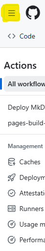
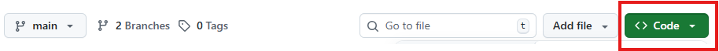

# Github 

## **GitHub-Account einrichten**

1. **Registrieren:** Gehe auf die GitHub-Website und klicke auf 
<a href="https://github.com/signup" target="_blank">Sign Up</a>

2. **Daten eingeben:** Folge den Anweisungen, gib deine E-Mail-Adresse ein, wähle ein starkes Passwort und einen **Benutzernamen**.

3. **Verifizieren:** Bestätige deine E-Mail-Adresse über den Link, den du erhältst.

## **Neues Projekt (Repository) erstellen**

Ein **Repository** (Repo) ist der Speicherort für dein Projekt auf GitHub.

1. **Repository erstellen:** Logge dich bei GitHub ein. Klicke oben rechts auf das **Pluszeichen** (+) und wähle **"New repository"** (Neues Repository).

2. **Namen wählen:** Gib einen kurzen, prägnanten **Repository-Namen** ein (z. B. mein-erstes-projekt).

3. **Beschreibung** (optional): Füge eine kurze Beschreibung deines Projekts hinzu.

4. Sichtbarkeit: Wähle zwischen **"Public"** (öffentlich, jeder kann es sehen) und **"Private"** (privat, nur du und eingeladene Mitarbeiter können es sehen).

5. **Initialisierung** (optinal): Aktiviere das Kästchen **"Add a README file"** (README-Datei hinzufügen). Das ist eine gute Praxis, da die README-Datei oft eine Projektbeschreibung enthält.

6. **Erstellen:** Klicke auf **"Create repository"**.

## **Codespaces**
### **Einrichten**

Du musst nichts manuell verlinken, da Codespaces immer direkt mit einem deiner GitHub-Repositorys verbunden sind.

1. **Navigiere zum Repository:** Gehe auf GitHub zu dem Repository, das du verwalten möchtest (das, welches du im ersten Schritt eingerichtet hast, z. B. `mein-erstes-projekt`)

  
Klicke hier, um das Bild zu sehen (Details)

  

Klicke hier, um das Bild zu sehen (Details)

  

    

      
    

  

  

2. **Codespace starten:** Klicke auf den grünen Button 
`< > Code`.

3. **Wähle Codespaces:** Wechsle zum Tab "Codespaces".

4. **Neuen Codespace erstellen:** Klicke auf **"Create codespace on main"** (oder auf dem Branch, den du verwenden möchtest).

GitHub führt nun folgende Schritte automatisch im Hintergrund aus:

- Es wird eine **virtuelle Maschine (VM)** zugewiesen.

- Es wird ein **Entwicklungscontainer** (mit allen notwendigen Tools und Abhängigkeiten) erstellt.

- Dein **Repository** wird in diesen Container geklont.

- Der **VS Code Editor** öffnet sich direkt in deinem Browser und zeigt deine Projektdateien an.

### **Code Bearbeiten und Änderungen verwalten**
Im Codespace nutzt du die integrierten Funktionen von VS Code, um deine Projektdateien zu bearbeiten und die Änderungen zu synchronisieren.

**1. Dateien bearbeiten**
- Du kannst Dateien über den Dateiexplorer (links in der VS Code Seitenleiste) öffnen und bearbeiten.

- Das Terminal unten im Codespace funktioniert genau wie das Terminal auf deinem lokalen Computer, sodass du dort deine üblichen Befehle (z. B. zum Starten der Anwendung, Installieren von Paketen) ausführen kannst.

**2. Git-Workflow** (Committen und Pushen)
Da dein Codespace bereits dein Repository geklont hat und du angemeldet bist, entfallen die Schritte git clone und die manuelle Authentifizierung.

- **Änderungen einsehen:** Klicke in der Seitenleiste auf das Quellcodeverwaltung-Symbol (drei Kreise, die Linien miteinander verbinden – das Git-Symbol).

- **Staging:** Alle Änderungen werden dort als **"Änderungen"** angezeigt. Klicke auf das **Pluszeichen (+)** neben einer Datei oder neben **"Änderungen"**, um die Dateien zur Staging Area hinzuzufügen `(git add .)`.

- **Commit:** Gib eine kurze, beschreibende **Commit-Nachricht** in das Textfeld ein (z. B. "Feature: Neue Navigation hinzugefügt"). Klicke dann auf **"Commit"**.

- **Push (Synchronisieren)**: Klicke auf den Button **"Änderungen synchronisieren"** oder **"Push"** (kann auch ein Pfeilsymbol nach oben sein).

Diese Aktion überträgt deine Commits direkt von deinem Codespace in dein GitHub-Repository.

### **Mit dem Team zusammenarbeiten**

Codespaces sind ideal für die Zusammenarbeit, da die Umgebung für jeden Mitarbeiter exakt gleich ist.

- **Pullen von Partner-Änderungen:** Wenn dein Partner Änderungen in das Repository hochgeladen hat, klicke im Codespace auf das Quellcodeverwaltung-Symbol und dann auf den "Pull"-Button (Pfeil nach unten) oder "Änderungen synchronisieren". Dadurch werden die neuesten Änderungen in deinen Codespace geholt.

- **Branches:** Du kannst Branches direkt im Codespace verwalten. Unten links in der Statusleiste von VS Code siehst du den aktuellen Branch (main). Klicke darauf, um einen **neuen Branch zu erstellen** oder zu einem **bestehenden Branch zu wechseln.**

- **Pull Request:** Nachdem du deine Änderungen in einem Feature-Branch gepusht hast, kannst du den **Pull Request** weiterhin über die **GitHub-Website** erstellen, um den Code von deinen Kollegen überprüfen zu lassen.

### **Codespace schließen und fortsetzen**

Da Codespaces in der Cloud laufen, sind sie nicht an deinen lokalen Computer gebunden.

- **Beenden:** Schließe einfach deinen Browser-Tab. Der Codespace wird nach einer gewissen Inaktivität (meist 30 Minuten, je nach Einstellung) automatisch gestoppt, um Kosten zu sparen.

- **Fortsetzen:** Wenn du auf github.com/codespaces oder den Code-Button deines Repositorys zurückkehrst, wird dein letzter Codespace angezeigt. Klicke auf ihn, um ihn innerhalb weniger Sekunden wieder zu starten, genau an dem Punkt, wo du aufgehört hast (inklusive aller geöffneten Dateien und des Terminalverlaufs).